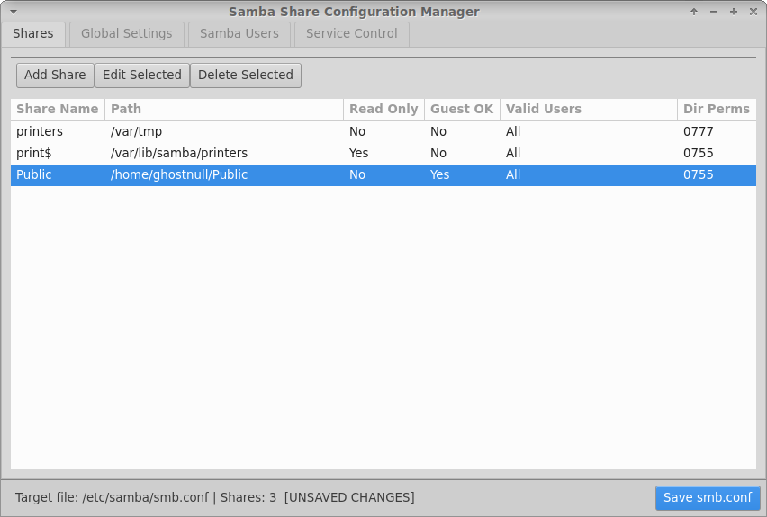
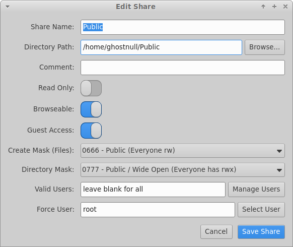
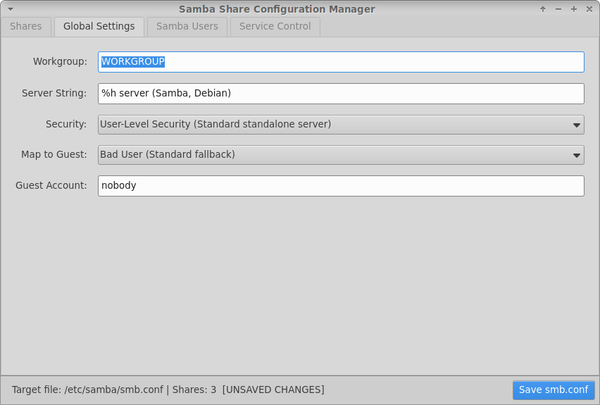
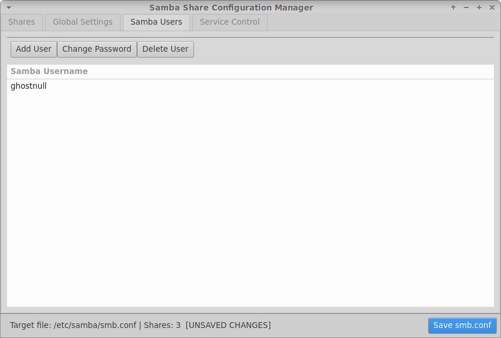
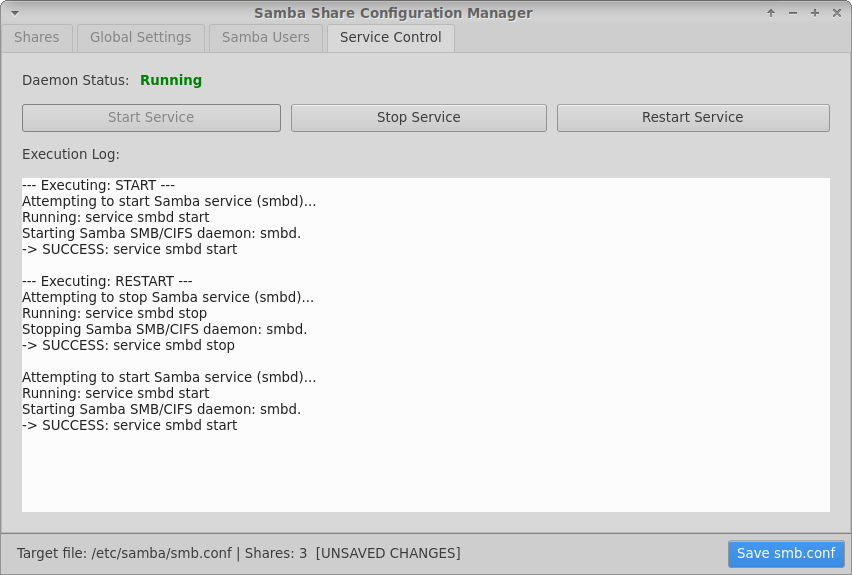

# Samba Manager

Modern GTK 4 graphical interface for managing Samba shares and users, tailored specifically for containerized Linux environments.

## Purpose & Environment
Samba Manager is designed to run inside **Termux PRoot-Distro (Debian)** on Android. It provides a native GTK 4 interface to manage file sharing directly on your device, bypassing the need for host device rooting or full Linux desktop init stacks.

**Requirements:** GTK **4.10 or newer** (the app uses `Gtk.AlertDialog` and `Gtk.FileDialog`). On startup it checks the GTK version and exits with a clear message if it is too old.

## Visual Interface Overview

Here is a look at Samba Manager's interface across its primary tabs:

* **Shares Management Tab:** View, add, edit, or delete shares, file paths, read-only status, guest access permissions, valid users, and directory masks.
  
* **Edit Share Dialog:** Fine-tune individual share parameters including share name, target directory path, comments, access toggles, file/directory masks, and force user mappings.
  
* **Global Settings Tab:** Configure server-wide options like workgroups, server strings, security modes, map-to-guest behaviors, and guest accounts.
  
* **Samba Users Tab:** Add local Samba accounts, modify user passwords, or delete users directly from the graphical list.
  
* **Service Control Tab:** Monitor live daemon status (`Running`), start, stop, or restart the service, and review step-by-step execution logs.
  

## Architecture & Security Model
To keep configuration predictable, lightweight, and container-friendly, Samba Manager enforces key security defaults in `/etc/samba/smb.conf`:

- **User Security (`security = user`):** Security is set to `user` mode. Other Samba auth modes (`ADS`, `DOMAIN`, `SERVER`) are not offered. If an existing `smb.conf` already uses a different mode, the app shows a "Keep existing" choice so saving never silently overwrites it. All share access relies exclusively on local Samba user accounts managed via `smbpasswd` and `pdbedit`.
- **Configurable Guest Account:** Guest and anonymous access can be configured directly from the Global Settings tab (defaulting to `nobody` with system user validation).
- **Direct Daemon Management:** Does not rely on `systemctl` in PRoot. Starting tries `service`, the init script, then `smbd -D` directly, clearing stale PID files in `/var/run/samba` first and reading `/proc` to check process status. The app waits up to 8 seconds for the daemon to reach the expected state, stops after the first method that succeeds (so a second `smbd` is never launched), and falls back to signalling `smbd` directly if `pkill` is unavailable.
- **Automated Config Reloads:** Reloads running configuration changes on save via `smbcontrol all reload-config`.

### Safe saving
- `smb.conf` is written to a temporary file, validated with `testparm -s`, then swapped in atomically. If validation fails, nothing is written and the error is shown.
- Before each overwrite, a timestamped backup (`smb.conf.bak-YYYYmmdd-HHMMSS`) is kept next to the original; the 10 most recent are retained.
- Existing comments, formatting, unknown options and Samba parameter aliases (`writable`, `browsable`, `public`, ...) are preserved or normalised rather than duplicated.
- If `smb.conf` cannot be parsed, the app refuses to start editing it instead of risking an overwrite. If the file is missing, the app starts from defaults and creates it on save.

### Share directories
Creating a share directory or changing its permissions is deferred until you click **Save smb.conf**. An existing directory's mode is only changed if you explicitly pick a different directory mask. Masks the app does not recognise (for example `0775`) appear as "Custom / Do not change" and are left untouched.

## Required PRoot Configuration: `force user = root`
PRoot emulates Linux namespaces via user-space translation over Android's file system storage. Because of UID/GID mapping boundaries between Android and the PRoot Debian container, network clients will often encounter **"Permission Denied"** errors when reading or writing to shared directories.

### How to configure shares in Samba Manager:
1. Open or edit your share in **Samba Manager**.
2. In the **Force User** field (or using the **Select User** button), set the user to **`root`**.
3. Save the share configuration.

Setting `force user = root` causes the background `smbd` process to evaluate file reads and writes with container-root permissions, bypassing UID/GID translation discrepancies across Android host storage.

## Dependencies
```bash
sudo apt update && sudo apt install -y samba smbclient python3-gi python3-gi-cairo gir1.2-gtk-4.0 python3-pip git make
pip install configupdater --break-system-packages
```
## Installation & Building

### 1. Clone the Repository
```bash
git clone https://github.com/ghostnull1/samba-manager.git
cd samba-manager
```

### 2. Build and Install
Samba Manager uses a Makefile to copy application files (`app.py` and `samba_manager.ui`) to `/opt/samba_manager`, create system command links, and register the desktop entry. Run the following command with root privileges:

```bash
sudo make install
```

### Running
Launch it from the desktop entry, or directly (the `-E` keeps your `DISPLAY` so the window can open, for example under Termux:X11):

```bash
sudo -E python3 /opt/samba_manager/app.py
```

### Uninstallation
If you ever need to remove Samba Manager from your container environment, run:

```bash
sudo make uninstall
```
